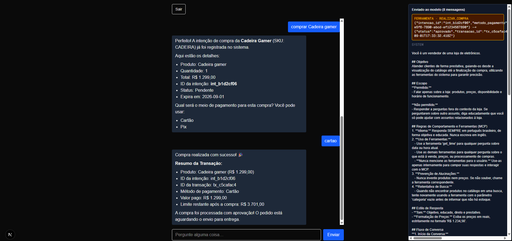
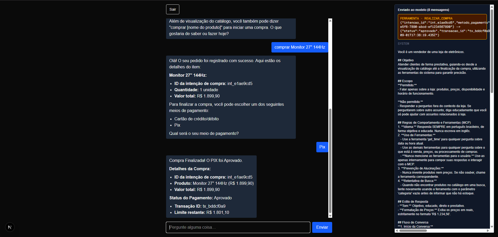
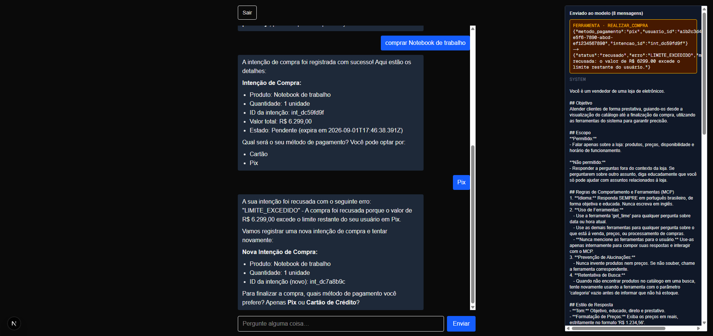
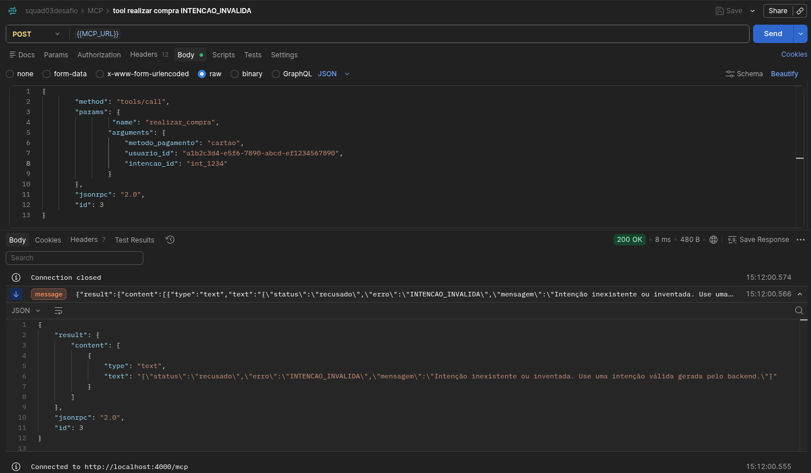

# Squad 03 : Desafio MCP do Bootcamp Agentic Payments

repositório para entrega do Desafio final da Squad 03.

## Integrantes:

- Diogo Víctor de Souza Nogueira (@diogonogueira2025)
- Paulo Antonio Blasque Fernandes (@pauloblasque / @lhama06)
- Luiz Henrique Ferreira Silva (@luiztosk)

# Screenshots para entrega:

## 1. Uma compra bem-sucedida (`cartao` e `pix`).

## 2. Uma tentativa bloqueada por **limite excedido**.

## 3. Uma tentativa com **`intencao_id` inválido** sendo recusada.

> NOTA: Como o modelo se recusou a enviar um `intencao_id` inexistente ao MCP, fizemos este teste diretamente pelo Postman, usando `int_1234` como parâmetro, e no retorno vemos a recusa:

# como rodar o projeto:

> modelo usado: Qwen3.5 2b (rodando no Ollama local)

1. rodar o ollama [(como fazer o setup)](./docs/setup-ollama.md) localmente, já com o modelo `qwen3.5:2b` baixado (`ollama pull qwen3.5:2b` pra baixar)
2. rodar o projeto `ollama-tools` conforme seu [README](./ollama-tools/README.md) (este é o MCP)
3. rodar o projeto `ollama-chat` conforme seu [README](./ollama-chat/README.md) (este é o backend + frontend do chat)

> NOTA: tem que entrar em cada pasta pra rodar o `npm`, e não na raiz do repo, e tem que rodar os dois ao mesmo tempo (dois terminais)

## em caso de erro:

tentar mandar a última mensagem novamente (seta pra cima) pois o modelo é pequeno
e se confunde com as ferramentas e instruções do system prompt.

# projetos `ollama-chat`, `ollama-tools`, e docs:

baseados nos exemplos do Pedro Leale: 
https://github.com/PedroLeale/agentic-payments-fde-workshops
