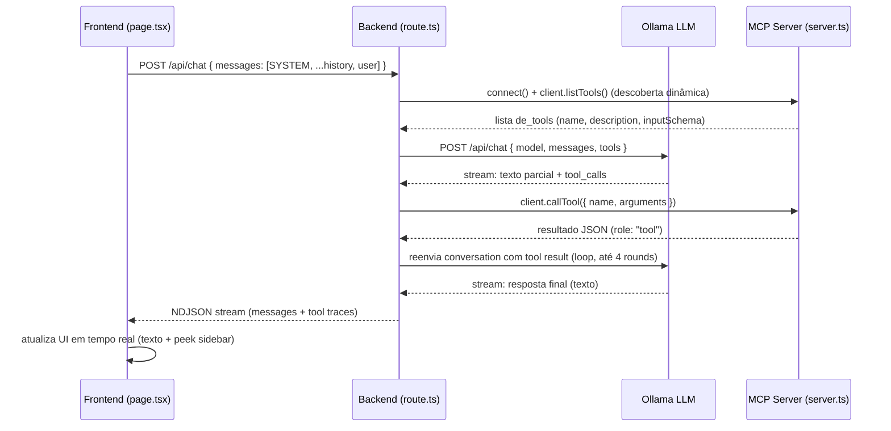

# Arquitetura do Sistema: System Prompt, Tools e Chamadas ao Modelo

## Visão Geral

Este projeto segue a arquitetura padrão de **MCP (Model Context Protocol) chat agentico**:

```
Frontend (Next.js + React) → Backend API (Next.js Route Handler) → MCP Server (Express) + Ollama
```

---

## 1. System Prompt (Prompt do Sistema)

### Onde é definido

- **Local**: `ollama-chat/src/app/page.tsx` (linhas 12–19)

### Como é composto

```typescript
const SYSTEM: Message = {
  role: 'system',
  content:
    'Você é um vendedor de uma loja de eletrônicos. Responda SEMPRE em português brasileiro, ' +
    'de forma objetiva e educado. Nunca escreva em inglês. ' +
    'Fale apenas sobre a loja: produtos, preços, disponibilidade e horário. ' +
    'Se perguntarem outra coisa, diga que só pode ajudar com a loja. ' +
    'Você tem ferramentas: use get_time para qualquer pergunta sobre data ou hora atual, ' +
    'e list_items para qualquer pergunta sobre o que está à venda ou quanto custa. ' +
    'Nunca invente produtos nem preços — chame a ferramenta. ' +
    'Mostre os preços em reais, no formato R$ 1.234,56.',
}
```

### Papel do system prompt

1. **Define o papel do modelo**: vendedor de eletrônicos
2. **Define o idioma**: português brasileiro
3. **Lista as tools disponíveis**: menciona `get_time` e `list_items`
4. **Regra de grounding**: "nunca invente produtos nem preços — chame a ferramenta"

### Como é enviado

```typescript
// page.tsx:58-59
const payload: Message[] = id === 'withHistory'
  ? [SYSTEM, ...history, user]  // histórico completo
  : [SYSTEM, user]              // sem histórico (stateless)
```

O system prompt é **prepended** a cada requisição enviada ao backend.

---

## 2. Passagem da Lista de Tools ao Modelo

### Backend (`ollama-chat/src/app/api/chat/route.ts`)

#### Passo 1: Conexão ao MCP Server

```typescript
async function connect() {
  const client = new Client({ name: 'ollama-chat', version: '1.0.0' })
  await client.connect(new StreamableHTTPClientTransport(new URL(MCP_URL)))
  return client
}
```

Conecta ao MCP server via HTTP (transport **streamable HTTP**).

#### Passo 2: Descoberta dinâmica de tools

```typescript
client = await connect()
const mcpTools = (await client.listTools()).tools
tools = toOllamaTools(mcpTools)
```

O modelo **descobre as tools dinamicamente** chamando `client.listTools()` no MCP server. Isso significa que:

- **Adicionar uma nova tool no MCP server** = ela aparece automaticamente no modelo
- **Nenhuma alteração no frontend ou backend** é necessária

#### Passo 3: Conversão do schema

```typescript
function toOllamaTools(mcpTools) {
  return mcpTools.map((t) => ({
    type: 'function',
    function: {
      name: t.name,
      description: t.description ?? '',
      parameters: t.inputSchema
    }
  }))
}
```

Converte o schema MCP para o formato esperado pela API do Ollama.

#### Passo 4: Envio junto com a requisição

```typescript
const res = await fetch(`${OLLAMA_URL}/api/chat`, {
  method: 'POST',
  headers: { 'Content-Type': 'application/json' },
  body: JSON.stringify({
    model: MODEL,
    messages: convo,
    tools,        // ← lista de tools
    stream: true
  })
})
```

O modelo recebe:
- `name`: nome da função
- `description`: descrição (usada pelo modelo para decidir quando chamar)
- `parameters`: schema JSON (tipos e restrições)

---

## 3. Como o Modelo Decide Chamá-la (Tool Calling)

### Quando o modelo decide chamar uma tool

O modelo analisa:
1. O **system prompt** (que menciona os nomes das tools e quando usá-las)
2. A **conversa histórica**
3. A **última mensagem do usuário**

Se decide chamar uma tool baseado no **nome + descrição + schema** recebidos.

### O que o modelo envia de volta

O modelo responde com um bloco `tool_calls`:

```json
{
  "message": {
    "role: "assistant",
    "content": "",
    "tool_calls": [
      {
        "function": {
          "name": "list_items",
          "arguments": { "search": "playstation" }
        }
      }
    ]
  }
}
```

### Como o backend coleta

```typescript
// route.ts:107-109
if (chunk.message?.tool_calls) {
  calls.push(...chunk.message.tool_calls)
}
```

Os `tool_calls` são coletados enquanto o streaming dura.

---

## 4. Execução da Tool pelo Backend

### Passo 1: Registrar a chamada no histórico

```typescript
// route.ts:120
convo.push({ role: 'assistant', content, tool_calls: calls })
// Assim o modelo "vê" que ele próprio chamou a tool
```

### Passo 2: Executar a tool via MCP client

```typescript
// route.ts:26-39
async function runTool(client, call) {
  const out = await client.callTool({
    name: call.function.name,
    arguments: call.function.arguments
  })
  const text = Array.isArray(out.content)
    ? out.content.find((c) => c.type === 'text')?.text
    : undefined
  return JSON.parse(text ?? 'null')
}
```

### Passo 3: Injetar o resultado no histórico

```typescript
// route.ts:121-124
for (const call of calls) {
  const result = client ? await runTool(client, call) : { error: 'no tool server' }
  convo.push({ role: 'tool', content: JSON.stringify(result) })
  line({ tool: { name: call.function.name, result } })
}
```

O resultado é adicionado como uma mensagem com `role: 'tool'`, fechando o loop:
**modelo chama → backend executa → resultado volta → modelo vê e responde**

---

## 5. Loop de Execução (Agentic Loop)

O backend repete este ciclo até `MAX_ROUNDS = 4`:

```
┌─────────────┐
│ Modelo      │ ← recebe: system + history + tools
└──────┬──────┘
       │ gera tool_calls
       ▼
┌─────────────┐
│ Backend     │ ← executa tools via MCP
└──────┬──────┘
       │ injeta resultado como role:"tool"
       ▼
┌─────────────┐
│ Modelo      │ ← vê o resultado, gera resposta final
└─────────────┘
```

### Condições de parada

- Modelo não chama mais tools → fim
- Máximo de 4 rounds (`MAX_ROUNDS = 4`) atingido
- Erro da API do Ollama

---

## 6. Frontend: Recebimento e Renderização

O frontend (`page.tsx`) consome o stream NDJSON do backend:

```typescript
// page.tsx:79-96
const reader = res.body.pipeThrough(new TextDecoderStream()).getReader()
for (;;) {
  const { value, done } = await reader.read()
  if (done) break
  buffer += value
  const lines = buffer.split('\n')
  // Parseia cada linha como JSON
}
```

Eventos recebidos:

| Evento             | Ação no frontend                          |
|--------------------|-------------------------------------------|
| `{ message: ... }` | Atualiza a resposta do assistente         |
| `{ tool: ... }`    | Registra a chamada na timeline (peek)     |
| `{ done: true }`   | Finaliza a resposta                       |
| `{ error: ... }`   | Mostra erro                               |

### Peek (sidebar de inspeção)

O clique no ícone de olho mostra:
- Quais mensagens foram enviadas ao modelo
- Quais tools foram chamadas + argumentos + resultados

---

## 7. MCP Server: Definição das Tools

### Local

`ollama-tools/src/server.ts`

### Como tools são registradas

```typescript
mcp.registerTool(
  'list_items',
  {
    description: 'Lista os itens à venda e seus preços em reais...',
    inputSchema: {
      search: z.string().optional().describe('Trecho do nome do item...')
    }
  },
  async ({ search }) => json(listItems({ search }))
)
```

### Transporte exposto

```typescript
// server.ts:47-52
app.post('/mcp', async (req, res) => {
  const transport = new StreamableHTTPServerTransport({ sessionIdGenerator: undefined })
  res.on('close', () => transport.close())
  await mcp.connect(transport)
  await transport.handleRequest(req, res, req.body)
})
```

- **Endpoint**: `POST /mcp`
- **Protocolo**: Streamable HTTP (conforme spec MCP)
- **Server-sent**: respostas são streamed de volta ao cliente

---

## Resumo Visual: Pipeline Completo


